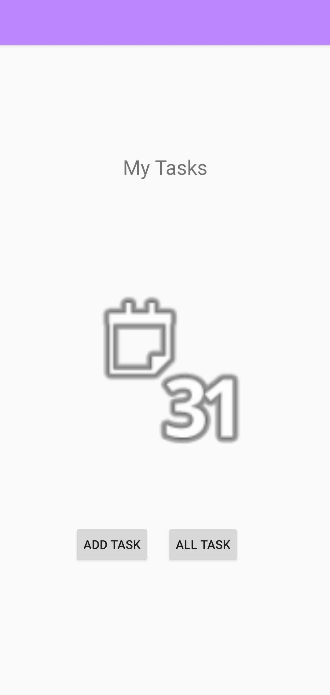
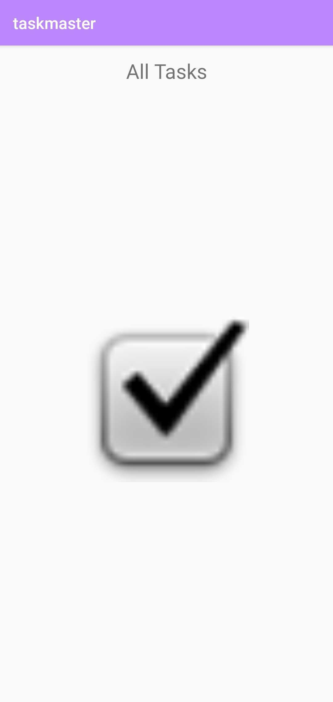
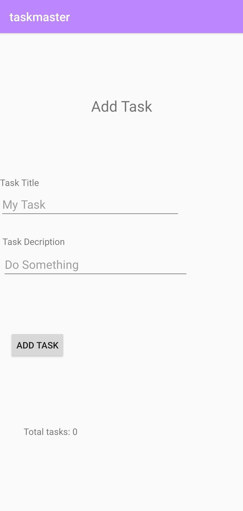
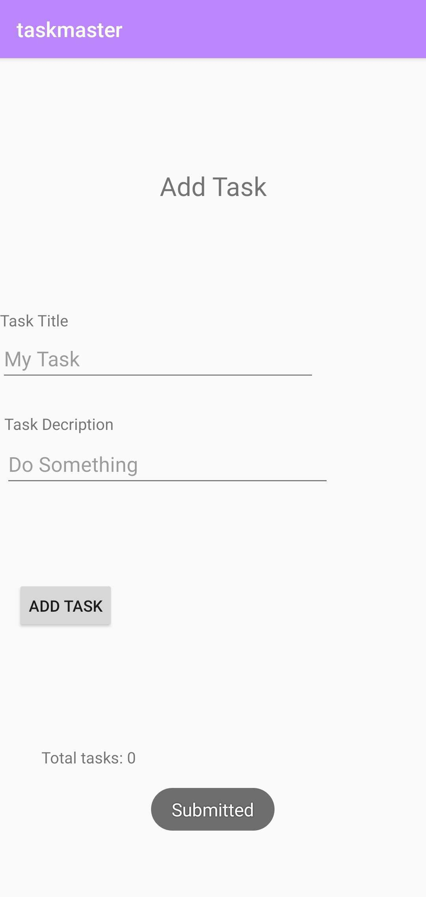
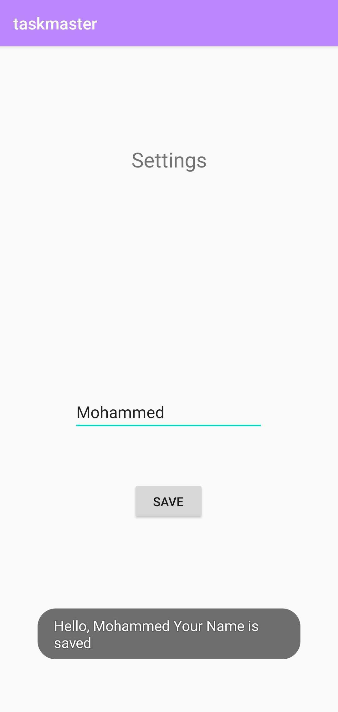
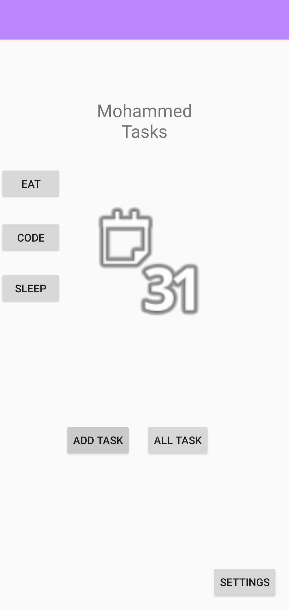
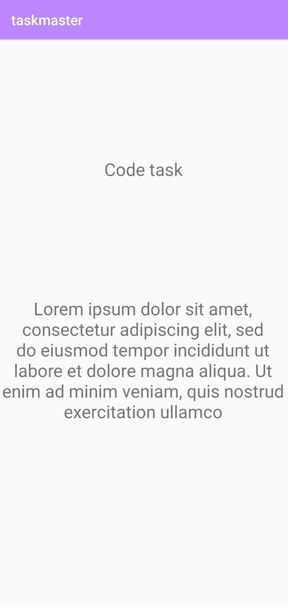
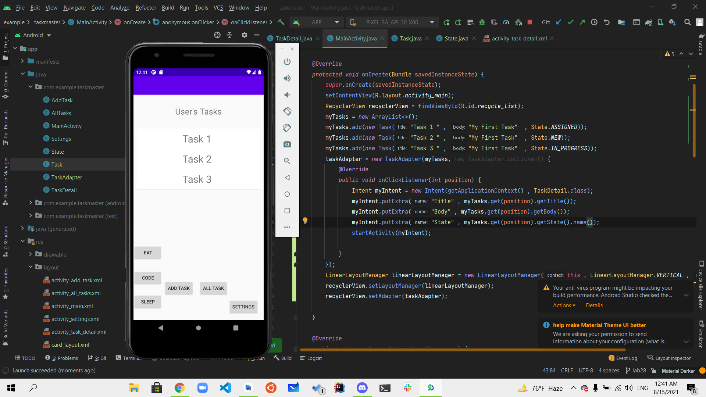
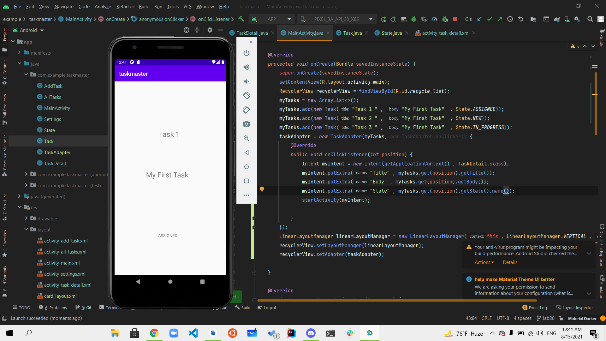

# TaskMaster

## Overview
Task Master is an android application to manage daily tasks built by android studio.

## Architecture 
This application was built using java language and android studio IDE platform

Author: Mohammed Mohiesen

## Lab: 26 - Beginning TaskMaster

- This lab was an introduction to android and how to build applications using android studio
- In this lab I created 3 activities Home, all tasks and add task and a button which shows a toast in the add task activity.

**Main Activity**
This Activity have a title, Image and two buttons to navigate through the other two activities.

**All tasks**
This Activity holds the tasks and contains an image and a title

**Add Task**
This activity holds a title and a text view followed by a plain text input for both title and description to the task and followed by a add task button which will show a toast with submitted toast.

**Add Task Button**
This Button when clicked will show a simple toast will show the text of submitted

## Lab: 27 - Data in TaskMaster

- In this lab I added a settings page which will take the user name from an edit text and add it to shared preferences and display it in the title textview on the main activity and display a toast to show the process and added three buttons to navigate to the task details page with the name of task shoed in a text view on the title.

**Settings Activity** In this page The user is allowed to add his name and it will be displayed in the home page title and also shows a toast with the same info.

**Main Activity** In this activity I added three buttons with three different text values which will navigate to the task detail page with the name on the title text view.

**Task detail Activity** In this activity the value of the button will be displayed on the title.

## Lab: 28 - Data in TaskMaster

- In this lab I added a recycler view to show all tasks
that the user had and implemented the task class with the appropriate data and displayed each task when clicked on an activity that shows task details.

**Main Activity** Added the recycler view to the main activity to show all the hard coded tasks and the user can click on them.

**Task Detail Activity** This is the task details page that will show the chosen task details based on what the user click's.

**Task detail Activity** In this activity shows when the user clicks on another task.
